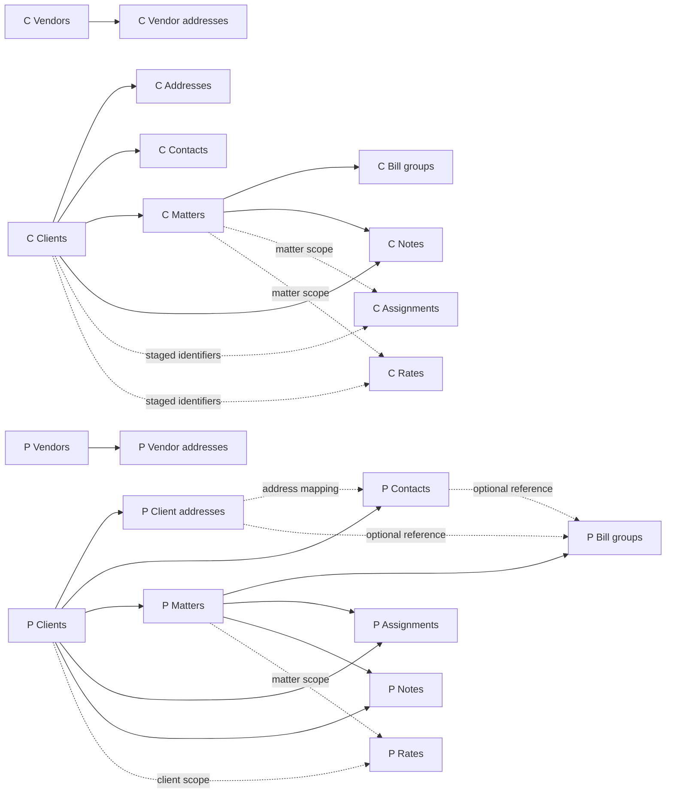

# Procedure dependency map and side-effect review

Issue [#1](https://github.com/chrismillsi2x/MergerManager/issues/1) is a static
assessment of the supplied ConversionSource export dated August 29, 2026.
It covers all 12 `CONVERT*` bodies, all 10 `PROMOTE*` bodies, and the related
`ResetClientNextMatterNumber` helper. No conversion SQL was executed.

The [operation inventory](procedure-operation-inventory.md) records every active
FROM/JOIN reference, INSERT, resolved UPDATE target and changed columns,
key-allocation call, and transaction/session control with original export line
numbers. Its [JSON counterpart](procedure-inventory.json) is machine-readable.
The source hash identifies the exact export reviewed. The raw export remains
private; physical hosts and databases are represented by distinct role aliases.

## Scope and evidence limits

`LOCAL` is the conversion database; `TEST` is the primary Expert test database;
`LEGACY_TEST` is a different test database used by the client alternatives and
reset helper; `PROD` is linked production; `REMOTE_STAGE` is a linked conversion
database. The latter cannot be assumed to be the current local project database.

Reads include anti-join duplicate checks and UPDATE joins, not only input data.
CTE names, comments, string contents, and variable names are not physical tables.
All 32 active EXEC calls in the reviewed bodies invoke `SP_CMSNEXTKEY_OUTPUT`.
There is no dynamic SQL in these bodies and no DELETE, MERGE, or TRUNCATE.
The allocator's definition, Expert tables/constraints/triggers, linked-server
configuration, permissions, actual row data, and external callers are absent.
Their transitive effects and runtime behavior remain unverified.

The offline extractor is a bounded lexical aid for this export, not a general
T-SQL parser. Manual review establishes semantics, ordering, and the decisions
below. It resolves UPDATE aliases within the following mutation block and
excludes the export's CTEs. Nested alias shadowing, additional SQL syntax, and
changes to procedure layout require review before reusing its results.

## Local staging contract

| Procedure | Active local reads | Active local writes |
| --- | --- | --- |
| CONVERTADDRESSES | ADDRESSES, CLIENTS, NAMES | ADDRESSES.TEST_ADDRESS_UNO |
| CONVERTASSIGNMENTS | ASSIGNMENTS | TEST_ASSIGNMENT_UNO, TEST_EMPL_UNO on ASSIGNMENTS |
| CONVERTBILLGROUPS | BILLGROUPS, MATTERS | BILLGROUPS.TEST_BILLGRP_UNO |
| CONVERTCLIENTS | CLIENTS, NAMES | NAMES.TEST_NAME_UNO; CLIENTS.TEST_CLIENT_UNO, TEST_NAME_UNO |
| CONVERTCLIENTS_OG | CLIENTS, NAMES | Same columns, plus an earlier CLIENTS name-ID synchronization |
| CONVERTCLIENTSHOLDER | CLIENTS, NAMES | Same columns, plus an earlier CLIENTS name-ID synchronization |
| CONVERTCONTACTS | CLIENTS, CONTACTS, NAMES | NAMES.TEST_NAME_UNO; CONTACTS.TEST_CONTACT_UNO |
| CONVERTMATTERS | CLIENTS, MATTERS | MATTERS.TEST_MATTER_UNO, TEST_MATTER_OPT_UNO |
| CONVERTNOTES | CLIENTS, MATTERS, NOTES | NOTES.TEST_TEXT_ID |
| CONVERTRATES | RATES | RATES.TEST_RATE_UNO |
| CONVERTVENDORS | NAMES, VENDORS | NAMES.TEST_NAME_UNO; VENDORS.TEST_VENDOR_UNO, TEST_NAME_UNO |
| CONVERTVENDORADDRESSES | VENDORADDRESSES, VENDORS | VENDORADDRESSES.TEST_ADDRESS_UNO, TEST_NAME_UNO; VENDORS.TEST_ADDRESS_UNO |
| PROMOTECLIENTS | CLIENTS, NAMES | NAMES.PROD_NAME_UNO; CLIENTS.PROD_NAME_UNO, PROD_CLIENT_UNO |
| PROMOTECLIENTADDRESSES | ADDRESSES, CLIENTS | ADDRESSES.PROD_ADDRESS_UNO |
| PROMOTECONTACTS | ADDRESSES, CLIENTS, CONTACTS, NAMES | NAMES.PROD_NAME_UNO; CONTACTS.PROD_CONTACT_UNO |
| PROMOTEMATTERS | CLIENTS, MATTERS | MATTERS.PROD_MATTER_UNO, PROD_MATTER_OPT_UNO |
| PROMOTEBILLGROUPS | ADDRESSES, BILLGROUPS, CLIENTS, CONTACTS, MATTERS | BILLGROUPS.PROD_BILLGRP_UNO |
| PROMOTEASSIGNMENTS | ASSIGNMENTS, CLIENTS, MATTERS | ASSIGNMENTS.PROD_ASSIGNMENT_UNO, PROD_MATTER_UNO, PROD_CLIENT_UNO, PROD_EMPL_UNO |
| PROMOTENOTES | CLIENTS, MATTERS, NOTES | NOTES.PROD_TEXT_ID |
| PROMOTERATES | CLIENTS, MATTERS, RATES | RATES.PROD_EMPL_UNO, PROD_RATE_UNO |
| PROMOTEVENDORS | NAMES, VENDORS | NAMES.PROD_NAME_UNO; VENDORS.PROD_VENDOR_UNO, PROD_NAME_UNO |
| PROMOTEVENDORADDRESSES | VENDORADDRESSES, VENDORS | VENDORADDRESSES.PROD_ADDRESS_UNO, PROD_NAME_UNO; VENDORS.PROD_ADDRESS_UNO |
| ResetClientNextMatterNumber | CLIENTS, MATTERS | None; updates LEGACY_TEST.HBM_CLIENT.NEXT_MATNO |

This confirms eleven staging tables. `MA_*`, `cw`, `gip`, `source`, local
`CXA_FOLDER_OBJECT`, and `BATCH_HISTORY` are not active dependencies of these
bodies. That does not prove they are unused by source extraction or ad hoc work.
No object deletion follows from this inventory.

The previous map overstated dependencies: `CONVERTCONTACTS` does not read
ADDRESSES, and `PROMOTECLIENTADDRESSES` does not actively read MATTERS or NAMES.
The latter references occur only in disabled updates (export 7887–7934).

## Target operations and key allocation

The operation inventory separates reads and writes for each procedure and each
environment. Important groupings are:

- Clients create HBM_NAME, HBM_NAME_PEOPLE, CXM_CONTACT, HBM_CLIENT, TBM_CLIENT,
  and TBH_CLIENT_SUMM. The three conversion alternatives are mutually exclusive
  candidates, not sequential steps.
- Contacts create name/person/contact records and CXA_FOLDER_OBJECT plus
  CXA_CLNT_ORG_CONT in TEST. Production instead inserts FAUX_CXA_FOLDER_OBJECT;
  the key allocator still receives CXA_FOLDER_OBJECT (8790, 8808).
- Matters create HBM_MATTER, TBM_MATTER, TBH_MATTER_SUMM, and TBM_MATTER_OPT.
  Conversion updates TBM_MATTER.OPT_UNO; the equivalent promotion update is
  commented out (9495–9502).
- Addresses insert HBM_ADDRESS. Conversion also updates client/name address
  pointers. Client-address promotion leaves those pointer updates disabled.
- Bill groups insert TBM_BILLGRP and update TBM_MATTER.BILLGRP_UNO. The production
  insert is unconditionally rolled back in the supplied body.
- Assignments insert TBM_CLMAT_PART; rates insert TBM_RATE_FEE and promotion
  repairs its client, matter, and employee references.
- Notes insert HBM_TEXT and update HBM_CLIENT.NOTES_TEXT_ID or
  HBM_MATTER.COMMENT_TEXT_ID. Both phases multiply allocated text IDs by ten.
- Vendors insert HBM_NAME, CXM_CONTACT, APM_VENDOR; vendor addresses insert
  HBM_ADDRESS and repair address/name/vendor pointers in both environments.

Each allocator call reserves IDs before the corresponding inserts. The code
assigns the returned range with ROW_NUMBER ordered by staging ID. Null staging
IDs drive allocation while destination anti-joins, where present, drive
insertion. Allocator internals and allocation rollback/concurrency behavior are
unknown. Reusing a stored ID is not evidence that the target row was committed.

## Load graph and cycles

The graph describes intended dependencies visible in data use, **not an
executable plan for the supplied SQL**. Blocking findings below need resolution
first. C means conversion and P means promotion; each P node additionally
requires its domain's successful TEST conversion. Personnel/code references
are external prerequisites: these procedures read HBM_PERSNL but never populate it.



| Edge / prerequisite | Evidence in export |
| --- | --- |
| C Clients → C Addresses | 4320–4321 consume staged name IDs; 4336–4352 update existing test client/name rows |
| C Clients → C Contacts | 6270–6275 and 6330–6336 use client/name relationships |
| C Clients → C Matters | 6459 and 6527 use CLIENTS.TEST_CLIENT_UNO |
| C Matters → C Bill groups | 4612–4618 update the already-created TBM_MATTER; OBS client/contact/address IDs need prior mapping |
| C Clients / Matters → C Notes | 6881–6895 and 6904–6918 insert and attach text to existing parents |
| C Clients / Matters → C Assignments, C Rates | 4383–4398 consume prefilled TEST client/matter/employee IDs; 6988–6989 consume OBS client/matter IDs without joining parent staging |
| C Vendors → C Vendor addresses | 7112–7114 consume vendor IDs; 7147–7189 repair pointers |
| P Clients → P Client addresses / P Contacts | 7877–7880; 8853–8859; 8915–8921 use staged client and name relationships |
| P Client addresses → P Contacts (conditional) | 8645 maps the TEST name's address to the production address |
| P Clients → P Matters | 9133–9146 use the converted client's production mapping |
| P Matters / Clients → P Bill groups | 7719 and 7731–7738 require production client/matter rows and linked staging; 7750–7753 attach the new bill-group ID |
| P Contacts / Addresses → P Bill groups (conditional) | 7720–7721 join their production mappings; null/default behavior requires a policy decision |
| P Clients / Matters → P Assignments | 7471–7477 populate production parent IDs; client-only assignments need separate handling |
| P Clients / Matters → P Notes | 9555–9574 and 9594–9613 attach text to production parents |
| P Clients / Matters → P Rates (conditional) | 9712–9722 and 9730–9752 map optional client/matter scope |
| P Vendors → P Vendor addresses | 9919–9951 map production names and repair parent pointers |
| Personnel test → production crosswalk | 7505–7506, 7722–7723, 8347–8350, 9137–9144, 9641–9642, 9710–9711 join by EMPLOYEE_CODE |
| Reset helper after legacy-test clients/matters | 10304–10321 calculates MAX(MATTER_NUMBER)+1 in LEGACY_TEST; not called by any conversion/promotion body |

No conversion/promotion procedure calls another conversion/promotion procedure,
so the direct procedure-call graph has no cycle. The ordering above is an
inferred data prerequisite graph, rather than a call graph.

At the table level there are expected cycles: names/clients ↔ addresses,
vendors ↔ vendor addresses, and matter billing rows ↔ bill groups/options.
The bodies break these by initially inserting zero/null references and then
updating pointers. Vendor names are created inside the vendor procedure before
vendor-address processing; vendor-address promotion inserts a possibly null
name reference, synchronizes it from VENDORS, then repairs HBM_ADDRESS.NAME_UNO
(9846, 9919–9923, 9946–9951). These are staged fixups, not a reason to recursively
rerun whole procedures. Disabled client-address and matter-option fixups leave
gaps, and the bill-group rollback invalidates that branch as supplied.

An eventual schedule can load clients, then independent contacts/addresses and
matters, then their dependents; vendors form a separate branch. However, all
domains share name/address key spaces and write tables that may contain other
projects. This graph is not permission to run those branches concurrently.

## Decision register

All entries are open. Issue #1 inventories them; the cited existing backlog
items own implementation or confirmation. No legacy behavior is approved here.

| ID | Observed behavior / evidence | Required decision and owner issue |
| --- | --- | --- |
| D01 | PROMOTEBILLGROUPS allocates and writes staging IDs (7543–7557), begins a transaction (7563), inserts, unconditionally rolls back (7743), then updates production matters (7748). No enclosing transaction appears in the body. | Treat as a rehearsal artifact until reviewed. Define atomic allocation/insertion/linkage and retry behavior; #17, #21, #35. |
| D02 | CONVERTADDRESSES uses a fixed company in main-address updates (4340, 4352). PROMOTEBILLGROUPS hard-codes another company and reads REMOTE_STAGE (7720–7734). | Replace with a reviewed scope policy and configured role bindings; #17. These bodies are unsuitable unchanged for concurrent mergers. |
| D03 | CONVERTCLIENTS_OG uses NAMES.SOURCE (5100, 5121), absent from the supplied NAMES definition (3232). HOLDER uses SOURCE_TYPE but joins HBM_CLIENT.CLIENT_UNO to c.TEST_NAME_UNO (6006). Both use LEGACY_TEST. | Choose/consolidate the active variant, validate column and ID semantics; #4. |
| D04 | CONVERTCLIENTS inserts most target tables without destination duplicate checks (4655, 4795, 4840, 4931, 5061); vendor-address conversion similarly inserts without an anti-join (7035, 7112–7114). | Establish idempotency and partial-failure recovery; #21. An allocated staging ID alone cannot gate retries. |
| D05 | All promotion bodies SET XACT_ABORT ON/OFF; only bill-group promotion declares a transaction, and it rolls back. No TRY/CATCH or COMMIT appears in the reviewed bodies. | Define caller-owned transaction/session restoration, linked-server behavior, and atomic audit evidence; #17, #35. XACT_ABORT alone does not establish an atomic run. |
| D06 | PROMOTECONTACTS allocates CXA_FOLDER_OBJECT keys but inserts FAUX_CXA_FOLDER_OBJECT (8790, 8808). Target DDL/triggers are absent. | Establish the supported contact/entity-manager integration and downstream movement, if any; #4, #17. |
| D07 | Client-address promotion pointer updates are commented out (7887–7934). It actively changes only local address IDs and production HBM_ADDRESS. | Specify which client/name/matter pointers are required and who sets them; #17, #18. Remove the earlier false dependency on MATTERS/NAMES. |
| D08 | PROMOTEMATTERS inserts TBM_MATTER.OPT_UNO as zero (9323), allocates/inserts options later (9390, 9407), and disables the pointer repair (9495–9502). | Add a verified option-link step if required; #17, #19. Inserting the option row is insufficient proof of attachment. |
| D09 | CONVERTBILLGROUPS uses TEST_*_UNO_OBS values; CONVERTRATES uses TEST_MATTER_UNO_OBS / TEST_CLIENT_UNO_OBS (6988–6989). RATES parent IDs are varchar while parent PKs are int. | Preserve consumed OBS fields until replacements and typed crosswalks are proven; #2, #12, #13. |
| D10 | Vendor promotion and vendor-address promotion do not filter PROMOTE; both staging vendor tables lack that column. Other promotions use company/PROMOTE/test-ID conditions and no batch parameter. | Define equivalent, run-scoped eligibility for vendors and prevent cross-run selection; #21, #37. |
| D11 | PROMOTEASSIGNMENTS fills parent IDs through an inner MATTERS join (7471–7477), but its insert also permits client-only rows (7494–7496). | Provide a client-only production-ID mapping path and verify personnel matching; #19. |
| D12 | Notes multiply allocated IDs by ten (6866, 9532), require CLIENT_ID for matter notes (6908, 9559), and update one parent pointer from potentially multiple rows. Promotion pointer comparisons use <> (9575, 9614). | Confirm text allocation convention, note cardinality/aggregation, and null-safe pointer replacement; #20. |
| D13 | Vendor-address conversion allocation selection checks address ID while the UPDATE checks name ID (7016, 7029). Preferred vendor address uses COALESCE(MAX(1099), MAX(REMIT)) (7134–7139). | Confirm retry predicate and address-selection business rule; #20, #21. |
| D14 | PROMOTECLIENTS name synchronization repeats n.COMPANY_CODE and lacks c.COMPANY_CODE / c.PROMOTE in that UPDATE (8222–8227); some later joins likewise rely on ID uniqueness. | Audit every statement's project scope and whether identifiers are globally unique; #17, #29, #35. |
| D15 | Reset helper points to LEGACY_TEST, calculates NEXT_MATNO from every matter of selected clients (10304–10321), and has no production equivalent here. | Decide supported environment, when to reset, and how to avoid collisions with live matter creation; #4, #17. |
| D16 | Allocator implementation, target constraints/triggers, role bindings, supported Expert version, and caller context are missing. | Obtain these as loader prerequisites; confirm allocation concurrency, transitive writes, and native audit coverage; #4, #17, #40. |
| D17 | Defaults include hard-coded audit user 5, office/currency and future end dates; data expressions truncate names/addresses. Counts are emitted as result sets without persistent audit. | Catalog approved target defaults and truncation validations; move execution identity and before/after evidence to the audited gateway; #2, #15, #35, #36. |

## Reproduction and verification

Node.js 24 was used; the scripts require no packages or database connection.
From the repository root, with an authorized local copy of the original export:

```powershell
node scripts/inventory-procedures.mjs <private-export-path> docs/architecture/procedure-inventory.json docs/architecture/procedure-operation-inventory.md
$env:CONVERSION_SOURCE_SQL = '<private-export-path>'
node --test scripts/inventory-procedures.test.mjs
```

Without `CONVERSION_SOURCE_SQL`, synthetic extraction tests and checked-in
inventory consistency tests still run; only the exact-source reproduction test
is skipped. Tests cover comment/string exclusion, CTEs, alias reuse, dynamic SQL
signals, key allocation, the bare rollback, and the corrected commented edges.
The source reproduction check compares all records and the exact UTF-8 hash.

The generated inventory contains object/column metadata and line references,
not SQL literals, credentials, source-firm rows, or executable production SQL.
It cannot validate target constraints, allocator behavior, or runtime success.
